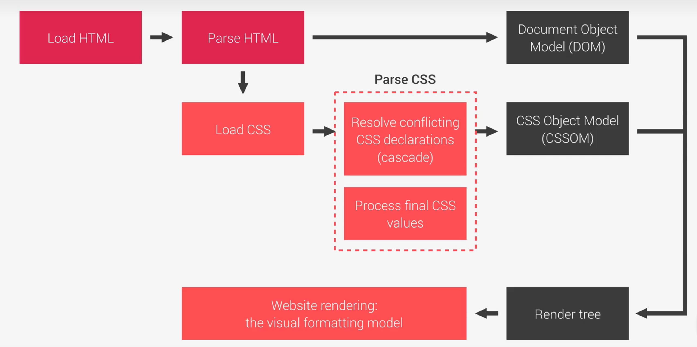
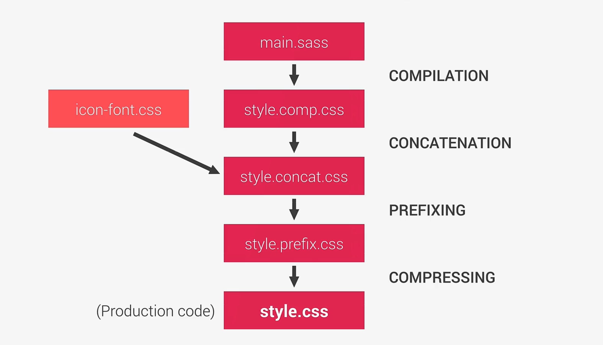

## Behind the Scenes of CSS

### Three Pillars of Writing Good HTML and CSS (Never Forget Them)

#### Responsive design

1. Fluid layouts
2. Media queries
3. Responsive images
4. Correct units
5. Desktop-first vs mobile-first

#### Maintainable and scalable code

1. Clean
2. Easy-to-understand
3. Growth
4. Reusable
5. How to organize files
6. How to name classes
7. How to structure HTML

#### Web performance

1. Less HTTP requests
2. Less code
3. Compress code
4. Use a CSS preprocessor
5. Less images
6. Compress images

### What Happens to CSS When We Load up a Webpage?

1. 解析HTML生成DOM树（遇到头部的link标签同时进行CSS解析）
2. CSS解析主要是解决冲突和处理最终值，解析完毕后生成CSSOM树 
3. DOM树和CSSOM生成渲染树 
4. 根据渲染树布局 
5. 渲染页面




### Cascade and Specificity

1. CSS declarations marked with ! important have the highest priority;
2. But, only use ! important as a last resource. It's better to use correct specificities - **more maintainable code**!
3. Inline styles will always have priority over styles in external stylesheets;
4. A selector that contains **1** ID is more specific than one with **1000** classes
5. A selector that contains **1** class is more specific than one with **1000** elements;
6. The universal selector  has no specificity value (0, 0, 0, 0, 0);
7. Rely more on **specificity** than on the **order** of selectors;
8. But, rely on order when using 3rd-party stylesheets - alwaysput your author stylesheet last.

###CSS Value Processing

1. Each property has an initial value, used if nothing is declared (andif there is no inheritance - see next lecture);
2. Browsers specify a **root font-size** for each page (usually 16px);
3. Percentages and relative values are always converted to pixels;
4. Percentages are measured relative to their parent's **font-size**, iffused to specify font-size;
5. Percentages are measured relative to their parent's **width**, if usedto specify lengths;
6. em are measured relative to their **parent** font-size, if used to specify font-size;
7. em are measured relative to the **current** font-size, if used to specify lengths;
8. rem are always measured relative to the **document's root** font-size
9. wh and vw are simply percentage measurements of the viewport'sheight and width.

### Think-Build-Architect

**Think about the layout of your webpage or web app before writing code.**

- **Modular building blocks** that make up interfaces;
- Held together by the **layout** of the page;
- **Re-usable** across a project, and between different projects;
- **Independent**, allowing us to use them anywhere on the page.

**Build** your layout in HTML and CSS with a consistent structure for naming classes.

- **B**lock **E**lement **M**odifier
- **BLOCK**: standalone component that is meaningful on its own.
- **ELEMENT**: part of a block that has no standalone meaning.
- **MODIFIER**: a different version of a block or an element.

Create a logical **architecture** for your CSS with files and folders.

7 different folders for partial Sass files, and 1 main Sass file to import all other files into a compiled CSS stylesheet.

```css
base/
components/
layout/
pages/
themes/
abstracts/
vendors/
```


## Sass

### What is Sass?

Sass is a CSS preprocessor, an extension of CSS that adds power and elegance to the basic language.

- **Variables**: for reusable values such as colors, font-sizes, spacirg, etc.
- **Nesting**: to nest selectors inside of one another, allowing us to write less code;
- **rator**s: for mathematical operations right inside of CSS;
- **Partials and imports:** to write CSS in different files and importing them all into one single file;
- **Mixins**: to write reusable pieces of CSS code;
- **Functions**: similar to mixins, with the difference that they producea value that can than be used;
- **Extends**: to make different selectors inherit declarationsthat are common to all of them;

### A Simple Build Process




