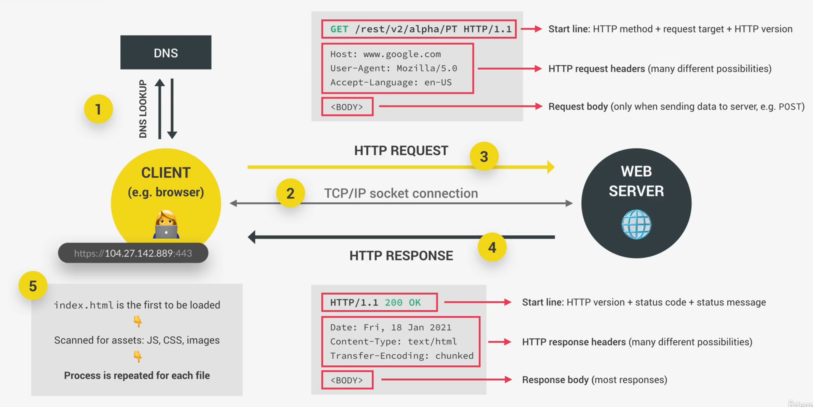
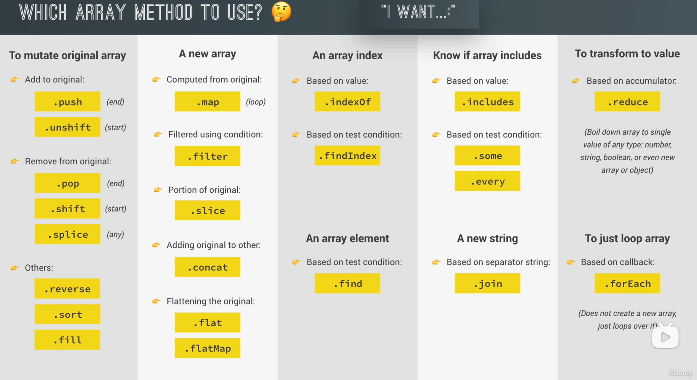
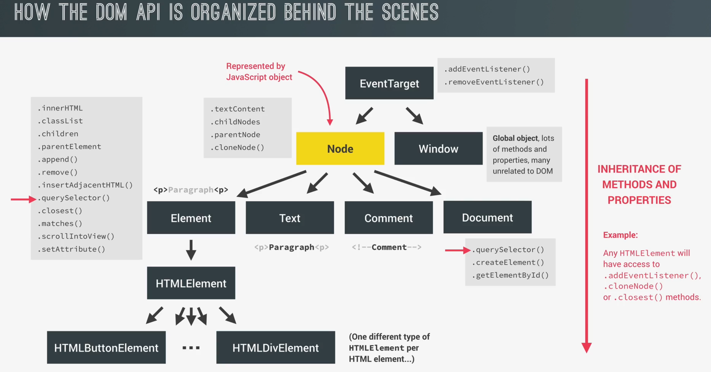
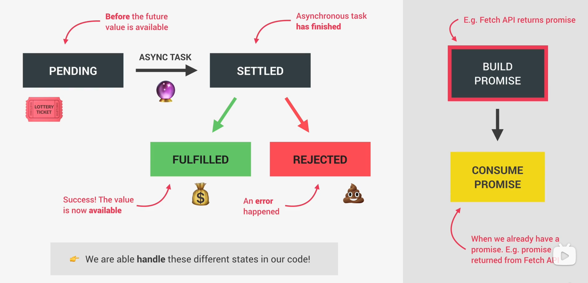
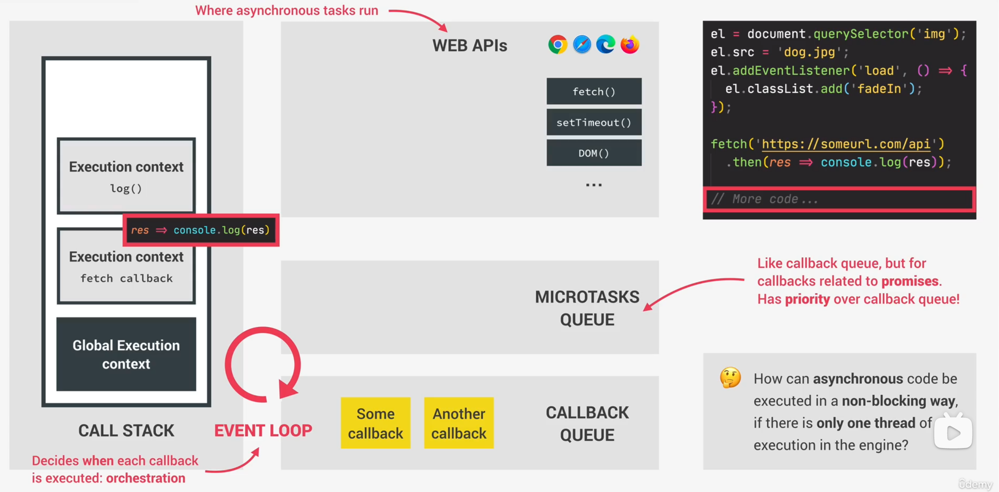

# JavaScript

## Questions remain

1. **数值精度**部分，有效数字这时总是`1.xx...xx`的形式，其中`xx..xx`的部分保存在64位浮点数之中，最长可能为52位。为什么JavaScript 提供的有效数字最长为53个二进制位？✅ [Js中的数字存储](https://fengmumu1.github.io/2018/06/30/js-number/)，[面试必备之详解JS数字精度](https://segmentfault.com/a/1190000021684144)
2. 


## How to Code

### How To Fail To Code

1. 没有一个明确的目标
2. 只是复制代码，而不关心它是如何工作的
3. 没有在课程和教程中强化他所学习的内容，或者做笔记。
4. 课外不练习，不去提出自己的想法。
5. 失去动力与信心，独自学习。
6. 自认为是一个程序员，但连自己的一个项目或者简单的应用程序也没有

### How To Do With that

1. He didn't have a clear goal at the beginning of his journey
   1. 拥有一个明确的目标，比如一年后我想成为一个优秀的全栈工程师，我应该如何做？具象化自己的目标。
   2. 重要的是找到一个原因，这会让你保持动力以应对越来越难的情况。
   3. Imagine a big project you want to able to build.
2. He would just copy the code without caring how it works.
   1. 始终确保自己真正理解代码。
   2. 不要只是复制粘贴。
3. He didn't reinforce what he was learning by doing small challenges or taking notes.
   1. 网站 codewar.com。
4. He didn't practice coding, and didn't come up with his own project ideas
   1. **自主练习永远是最重要的事情**。
   2. 在没有任何课程指导的情况下自己编写项目，非常重要。
   3. 走出自己的舒适区才是唯一的成长途径。不要陷入教程陷阱。
   4. 模仿常见的页面的写法 copy。
5. He quickly became frustrated when his code was not perfectly clean or efficient
   1. 干净高效的代码会随着时间而出现。
6. He lost motivation because he thought he could never know everything
   1. **你永远不会知道一切**
7. 某一个时刻你就会发现你已经特别擅长写代码了
8. web 开发的变化本身就非常快，你要学会去适应新的技术。
9. **keep going, keep coding and keep building.**

### How To Think Like a Developer & Problem Slover

1. 当我们说解决问题的时候，我们说的是一个真正的需要解决方案的真正问题。
2. Stay calm and slow down, don't just jump at a problem withouta plan.
3. Take a very logical and rational approach (programming is just logic, in the end...)
4. Use my 4-step framework to solve any problem
   1. 确保你 100% 理解问题，跳出当前去看大局，并且提问出正确的问题。
   2. 一个大问题化成多个小问题。
   3. 不害怕做尽可能多的研究。
   4. 对于一个大的问题，可以尝试着写一些伪代码。
   5. 培养真正的好奇心和热情。

### How the web works



## JavaScript Fundamentalsjs

### Clean code

1. 5 falsy values: 0, "", undefined, null, NaN
2. 根据干净代码的一般原则，尽量避免使用 loose equality operator ("==")。
3. 语句(statement)和表达式(expression)：表达式产生值，而语句就是翻译我们行为的完整的句子。
4. 注意：在模板文字(template literal) 中，我们只能插入表达式，不能插入语句。


### Display Type Conversion

1. Number(mix), parseInt(string , radix), parseFloat(string), toString(radix), String(mix), Boolean()
2. Number() 会想尽一切办法把括号里的内容转化为数，null -> 0, true -> 1, false -> 0, Number(undefined) 结果是 NaN， 普通字符串结果 NaN
3. parseInt(string , 进制) 会将其中的内容转化为**整数**，如果是字符串的数从数字位开始截取到非数字位为止给你转化成数，如果是 null，false，true 直接 NaN，如果 radix 不为空，**则以目标进制为基底转化成十进制。radix 取值范围（2，36）**
4. parseFloat(string , 进制)：转化成正常小数，如果是字符串的数从数字位开始截取到非数字位为止给你转化成数
5. String(): 写任何东西都变成 string
6. Boolean() : 空串""是 false，
7. toString(radix): toString 作为一个函数，undefined 和 null 都不能用 tostring，如果 radix 不为空，则以当前进制为基底转化成目标进制(radix)。

### Implicit Conversion

1. +"string" ，可以隐式转换 string 为Number类型。
2. isNaN(), 检查一个值是否不是个数。
3. isFinite(), 检查一个值是否是数字的最佳实践。

### Program 5,6,7 summarize

1. 使用清晰和语义化的变量名。使用像 activePlayer 这样的名称而不是 player。
2. 将数据与 UI 分离。将数据存储在 scores 和 activePlayer 等变量中，并使用这些数据更新 UI 元素。这使得代码可重用和可维护。
3. 将逻辑拆分为函数。像 init()， switchPlayer()这样的函数保持了主逻辑的简洁。
4. 将初始化逻辑封装在函数中。init()函数将游戏状态重置为初始条件
5. 在 New Game 按钮中添加监听器来调用 init()并重置游戏。
6. 使用 classList 来切换 UI 状态，而不是直接编辑 HTML。这将状态管理(数据)的职责与 UI 呈现分离开来。
7. 在每个回合之后检查获胜条件，而不是在最后，提供即时反馈，设置整个状态。
8. 遵循关注点分离、封装、模块化和使用语义名称等原则。让你的职能集中，只做一件事。并尽可能使用函数重置状态。

## How Javascript Works Behind the Sences

### Overview

1. js 是一个面向对象的，多范式的，解释型，动态的，单线程，垃圾回收机制，具有非阻塞事件循环并发模型的编程语言。
2. High-level
3. Garbage-collected
4. Interpreted or just-in-time compiled
5. Multi-paradigm
   1. Procedural programming
   2. Object-oriented programming (OOP)
   3. Functional programming (FP)
6. Prototype-based object-oriented
7. First-class functions：In a language with first-class functions, functions are simply treated as variables. We can pass them into other functions, and returin them from functions.
8. Dynamic
9. Single-threaded
10. Non-blocking event loop

### The JavaScript Engine and Runtime

1. 任何一个 js 引擎 = 调用栈（代码实际执行） + 堆（存储程序需要的对象）。
2. 即时编译：现代 js 引擎混合使用编译和解释 (先通过编译整个编译成机器码，后执行)。
3. 现代引擎的原理：开始编译的结果就是产生一个未优化的机器码，以至于可以快速执行，然后在后台代码继续优化，并且在已经运行的程序执行期间重新编译，并且这个过程会多次持续，直至未优化的代码彻底变成优化后的代码（发生在引擎内部的我们无法通过代码访问的线程）
4. js runtime = js Engine + web API(为 Engine 提供功能，但不是一部分) + Callback queue（比如事件处理函数，调用过后重新放入回调队列，**当调用栈为空时，回调函数被传回栈**）
5. Node.js js runtime = js Engine + C++ Bindings & Thread Pool + callback queue

### Execution Contexts and the Call Stack

执行的具体步骤

1.  创造一个 global execution of context (for top level code, 这里的 top level code 不在任何函数中) 执行非调用函数的代码和接收函数声明(Exactly one global execution context (EC))
2.  Execution context: Environment in which a piece of JavaScript is executed. Stores all the necessary information for some code to be executed.（披萨盒子是环境，披萨是 code，吃披萨工具和收据是必要的信息）
3.  Execution context = vairable environment + Scope chain + this keyword
4.  One execution context per function: For each function call, a new execution context is created,**all together make the call stack**
5.  调用栈：每个执行上下文堆叠在一起，为了追踪我们在程序执行中所处的位置，执行完就弹出（"Place" where execution contexts get stacked on top of each other, to keep track of where we are in the execution）
6.  代码在调用栈中的执行上下文中运行

### Scope and The Scope Chain

1. Scoping: How our program's variables are organized and accessed.
2. Scope: Space or environment in which a certain variable is declared (variable environment in case of functions). There is **global** scope, **function** socope, and **block** scope;
3. Scope of a variable: Region of our code where a certain variable can be accessed.
4. Three Type of scope
   1. global scope
   2. function scope
   3. block scope : only let and const are block scope (**Functions are also block scoped**(only in strict mode))
5. call stack, execution context, variable environment , scope
   1. 全局变量（global scope）中的可用变量就是存储在全局执行上下文(global execution context)的那些变量环境(variable environment)
   2. Every scope always has access to all the variables from all its outer scopes. This is the scope chain
   3. scope chain 只和代码被写在了哪里有关，和代码是否被调用，调用顺序无关
   4. 当一个变量不在当前范围，引擎就会想上寻找直到找到变量在哪里。
   5. The scope chain in a certain scope is equal to adding together all the variable environments of the all parent scopes;（某作用域内的作用域链等于所有父作用域的所有变量环境的总和;）

### Variable Environment: Hoisting and THE TDZ 提升机制

1. Hoisting: Makes some types of variables accessible/usable in the code before they are actually declared. "Variables lifted to the top of their scope".(在你声明之前先使用)
   1. 函数声明：Hoisted ✅; Initial Value: Actual function; Scope: Block
   2. var variables: Hoisted ✅; Initial Value: underfined ; Scope: Function(var 在全局变量上创建)
   3. Let and const variables: Hoisted ❌; <uninitialized>,TDZ; Scope: Block
   4. function expressions and arrows: Depends if using var or let/const
2. Before execution, code is scanned for variable declarations, and for each variable, a new property is created in the variable environment object.(在执行之前，扫描代码以查找变量声明，并且在变量环境对象中为每个变量创建一个新属性。在全局对象上创建一个属性)
3. Why TDZ : Makes it easier to avoid and catch errors: accessing variables before declaration is bad practice and should be avoided; 2） 让 const 常量真正起作用，因为我们不能重新分配 const

### This key word

1. this keyword/variable: Special variable that is created for every execution context (every function) Takes the value of (points to) the "owner" of the function in which the this keyword is used.
2. this is **NOT** static. It depends on how the function is called, and its value is only assigned when the function is actually called.
3. this 的四种使用方法
   1. Method ：this <Object that is calling the method> **this 总是指向调用该方法或者属性的对象**
   2. Simple function call this = undefined Arrow functions 函数中直接调用就是 undefined
   3. this = <this of surrounding function (lexical this) > ， **arrow functions 调用 this 就是 window，因为 arrow function 没有自己的 this，只能调用父函数的 function**
   4. Event listener this = <DOM element that the handler is attached to>，this 关键字总是指向元素本身。
4. this does NOT point to the function itself, and also NOT tthe its variable environment!(this 不是指向函数本身，也不是它的变量环境!)
5. arguement 关键字：只有函数表达式里存在 arguement 关键词，箭头表达式里没有。

### Regular function vs Arrow Function

1. 当我们试图访问一个不存在的属性，不会报错，只会有 undefined。
2. arguement 这个关键字只存在于常规函数之中（比较过时的方法）。
3. Arrow Function{}中书写代码片段 箭头函数的特点
   1. 当你的形参只有一个的时候, 可以不写小括号。
   2. 如果你的形参没有或者两个及以上, 必须写小括号。
   3. return 可以省略。

### Primitive VS. Objects (Primitive VS. Reference Types)

1. 七种基本类型：Number, Sting, Boolean, underfined, Null, Symbol, BigInt
2. 独特的动态类型机制
3. 原始类型和引用类型在内存中的存储方式是相当不同的。基本类型存储在执行上下文中（但因为执行上下文在调用栈内，也可以说是在栈中），引用类型存储在堆中。
4. const 不改变只适用于原始类型
5. 引用类型：当你复制一个对象时，你只是在创建一个变量指向新对象。


### Math and Rounding

1. Math.sqrt(), 平方根
2. Math.max(a,b,c,d), 返回最大值
3. Math.min(a,b,c,d), 返回最小值
4. Math.random(), 返回从(0,1]的一个小数。
5. Math.round, Math.ceil,四舍五入
6. Math.floor() 比 Math.trunc() 好的一点在于后者只是简单去除小数点后的部分，而前者会向更小的部分四舍五入。
7. toFixed() , 括号可以跟参数，小数的四舍五入，返回的是字符串。

### Tips

1. typeof(typeof(undefined)) 返回 string 值, 因为内层返回 undefined 是字符类型。
2. 数组、null 放进去返回值也是 object
3. typeof(NaN) -> number

## Data structures

### Spread operator

1. 扩展运算符适用于所有的可迭代对象。(Iterables: arrays, strings, maps, sets, NOT object) [...xxx]
2. 扩展运算符的主要用途就是解包一个数组构建新数组和将多个值传递给函数，通常当实参用，分发参数
3. Rest pattern and parameters 用作形参收集参数，或者用逗号分隔的变量名,常用在等号左边。

### Logical Operator（用于替代 if 语句）

1. undefined, null, NaN, " ", 0, false ===> false
2. || 一碰到真就返回真的表达式，全假就返回最后一个值。
3. && 如果是多个表达式的话，只要是真就一直往后走，一旦碰到假就返回假的位置。
4. Nullish(??): null and undefined (NOT 0 or '')
5. 逻辑赋值运算符(ES2021 引入)：||= 和 &&=
6. 链接运算符 ?., 只有?.前面的成立，才会往后走，经常与无效合并运算符(??)一起使用

### Looping Objects: Object Keys. Values. and Entries

1. 数组中使用 entries 方法 和对对象使用是相当不同的。

```javascript
/* Demo of Object.entries() */
const object1 = {
  a: "somestring",
  b: 42,
};

for (let [key, value] of Object.entries(object1)) {
  console.log(`${key}: ${value}`);
}

// output:
// "a: somestring"
// "b: 42"
/* Demo of Array entries()  */
var fruits = ["Banana", "Orange", "Apple", "Mango"];

for (let [key, value] of fruits.entries()) {
  console.log(`${key}: ${value}`);
}

// output:
// 0: Banana
// 1: Orange
// 2: Apple
// 3: Mango
```

### Strings

1. 为什么 string 是原始类型还能有方法？当我们在 string 调用方法的时候，js 自动在幕后把 string 原始类型转化为 string 对象，调用结束以后，js 再转回来。
2. split(),根据指定分隔符分割字符串，后返回一个数组。
3. toLowerCase(),toUpperCase(),返回字符串的大小写。

### Array,Sets and maps

1. array: pop 删除、
   1. slice(),返回一个数组，截取数组元素，不会改变原本数组，什么参数都不填就是复制原数组。（浅拷贝）
   2. split(),根据某个字符分割，会返回一个数组。
   3. splice(),提取数组元素，会改变原本数组, 原有数组会丢失被提取的部分。不过我们通常的用法就是直接删除最后一个元素，什么参数都不放就是复制数组。
   4. reverse(), 返回一个数组，将原数组反转，会改变原数组。
   5. concat(),将两个数组连接。
   6. join(), 会返回一个带有我们指定分隔符的**字符串**。
   7. fill(), 填充数组元素，可以填一个参数，两个参数，三个参数
   8. at(),可以在其中指定相关索引，多用于返回最后一个值，也适用于字符串。
   9. entries(), 返回两个值，一个是索引，一个是值。
   10. forEach(), 是一个高阶函数，内部要放回调函数。高阶函数的三个参数(当前元素，元素的索引，数组)
   11. for...of loop, 当你需要 for 循环过程中有 break，continue 的请求的时候就用。
2. sets 无顺序，不重复
   1. forEach(),高阶函数的三个参数(value，value，set)
3. Map:set(),get(), 对对象使用两个方法需要提炼
   1. forEach(),高阶函数的三个参数(value，key，map)
4. data transformation: map,filter,reduce
   1. map(value,index,array): 返回一个新数组，其中包含对所有原始数组元素应用操作的结果，比如统一加一个或者减去一个数。
   2. filter(value,index,array): 返回一个新的数组，其中包含通过**指定的测试条件**的数组元素
   3. reduce((acc,cur,i,arr),other) : 将所有数组元素浓缩(“缩减”)为一个值
   4. find(),不会返回新数组，而是返回满足条件的第一个元素，用途就是定向搜索。
   5. findIndex(),只是返回当前索引，比 indexOf() 高级的一点在于可以放入不同的条件。
   6. some(),只是一个判断真假的方法，其中可以加入高阶函数作为判断条件，有符合的就返回真。
   7. every(),判断真假的方法，当所有元素都满足要求。
   8. flat(),不需要加入回调函数，可以把解耦嵌套的数组，默认只解耦一层，可以填写参数改变。**通常使用时先用 map 把数据拿出来，后 flat 展平，之后再 reduce 或者其他。**
   9. flatMap(),结合了两个方法，但只深入一层。
   10. sort(),默认会把所有元素都变成 string,然后排序，不过可以加入回调函数,**会对原始数组进行更改**。
       - String,从 A 到 Z 排队。
   11. from( \_,i),当我们不需要使用第一个元素的时候，但又需要一个索引的时候，用\_代替



### Which data structure to use?

SOURCES OF DATA

1. **From the program itself**: Data written directly in source code (e.g. status messages)
2. **From the UI**: Data input from the user or data written in DOM (e.g tassks in todo app)
3. **From external sources**: Data fetched for example from web API (e.g.recipe objects) ,data from web APIS usually comes in a special data format.

Data structure, javascript only has four built-in data structure

1. Simple list: Arrays or Sets.
2. key/value pairs : Object or maps.

Arrays:

1. Use when you need ordered list of values (might contain duplicates)
2. Use when you need to manipulate data

Sets:

1. Use when you need to work with unique values
2. Use when high-performance is really important
3. Use to remove duplicates from arrays

Objects:

1. More "traditional" key/value store ("abused" objects)
2. Easier to write and access
3. values with . and []
4. Use when you need to include functions (methods)
5. Use when working with JSON (can convert to map)

Maps:

1. Better performance
2. Keys can have any data type
3. Easy to iterate
4. Easy to compute size
5. Use when you simply need to map key to values
6. Use when you need keys that are not strings

### A closer look at function

#### How passing arguement works?

只有值传递，没有引用传递，引用类型的数据是存在堆内存中的，而该堆内存的地址是存在栈指针的值中的，参数传递引用类型数据时传递的也是栈指针的值，而不是堆地址的值。

#### First class vs Higher-Order function

 first class function 只是编程语言有或者没有的一个功能

1. JavaScript treats functions as first-class citizens
2. This means that functions are simply values
3. Functions are just another "type" of object

#### Higher-Order function

1. A function that receives another function as an argument, that returns a new function, or both.
2. This is only possible because of first-class functions.

有两个好处：1.可以拆分成更多的可重复使用和关联的部分。2.隐藏不必要的细节，允许我们创建抽象。

#### Call & Apply & bind 

函数它们可以指定函数中的 this 指向哪个对象，以及传递参数给函数。

1. Call，，call 函数允许你在一个特定的上下文中调用一个函数。
2. apply(),**已过时**，apply 函数与 call 函数类似，它也允许你在一个特定的上下文中调用一个函数。不同之处在于，apply 函数需要将参数作为数组传递。
3. bind() 它不会立即调用函数。相反，它返回一个新函数，该函数将绑定到指定的上下文，当该函数被调用时，它将以指定的上下文运行。

#### Immediately Invoked Function Expressions.

1. 仅仅用于单次执行，用完就没了

#### Clousure

1. 闭包 A closure is the closed-over **variable environment** of the eexecution context **in which a function was created**, even after that execution context is gone;
2. A closure gives a function access to all the variables **of its parernt function**, even **after** that parent function has returned. The function keeps a **reference** to its outer scope, which **preserves** thhe scope chain throughout time.
3. A closure makes sure that a function doesn't loose connectionto **variables that existed at the function's birth place;**（像是一个离开家乡的人并不会失去和他的家乡的联系。）
4. A closure is like a backpack that a function carries around whenrever it goes. This backpack has all the **variables that were present in the environment where the function was created**

5. A function has access to the variable environment (VE) of theexecution context in which it was created。任何函数总是可以访问变量环境创建函数的执行上下文，即使创建它的那个变量环境已经消失。
6. Closure: VE attached to the function, exactly as it was at the ttime and place the function was created.闭包就是依附到函数上的变量环境，和函数创建的时间地点完全相同。
7. 由于闭包，函数不会失去和函数创建所在地的变量的链接。
8. We do **NOT** have to manually create closures, this is a JavaScript feature that happens automatically. We can't even access closed-over variables explicitly. A closure is **NOT** a tangible JavaScript object


## DOM

### How Dom really works?

1. Allows us to make JavaScript interact with the browser;
2. We can write JavaScript to create, modify and delete HTML elerments;set styles, classes and attributes; and listen and respond to events
3. DOM tree is generated from an HTML document, which we can then interact with;
4. DOM is a very complex API that contains lots of methods and properties to interact with the DOM tree.





### Selecting, Creating, and Deleting elements

Selecting

1. document.querySelector(),选择符合条件的第一个元素
2. document.querySelectorAll(),选择符合条件的所有元素，返回一个Nodelist
3. document.getElementById(),
4. document.getElementsByTagName(),返回一个实时更新的HTMLCollection
5. document.getElementsByClassName(),返回一个实时更新的HTMLCollection


Creating

1. .insertAdjacentHTML(, ),插入元素
2. createElement('ElementName'),创建一个元素

Deleting

1. remove()


## Asynchronous

### Promise




### How Asynchronous JavaScript works behind the scene



