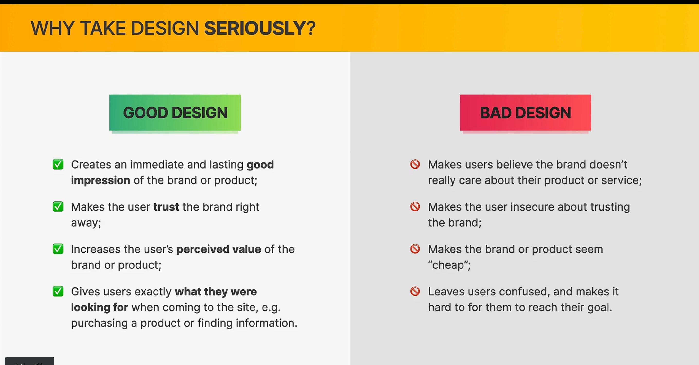
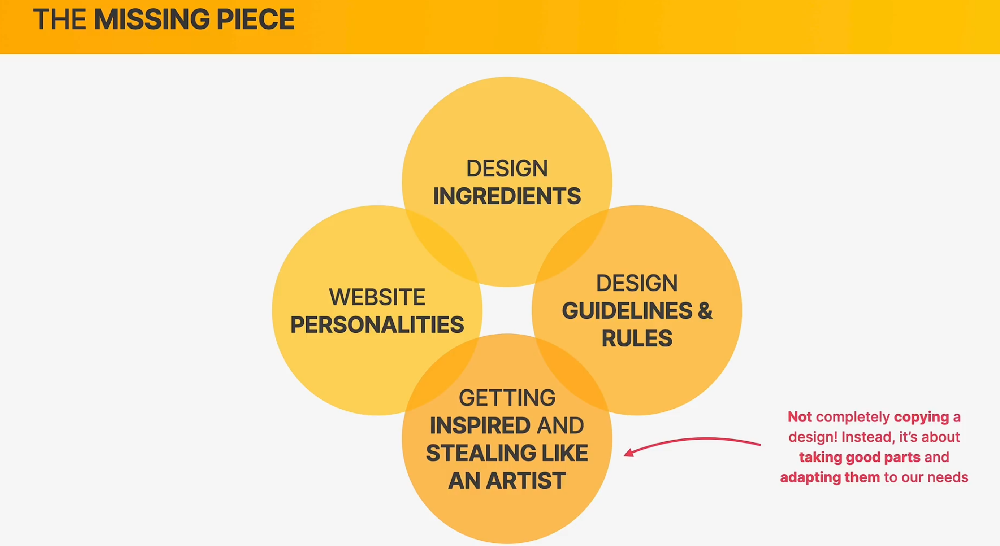
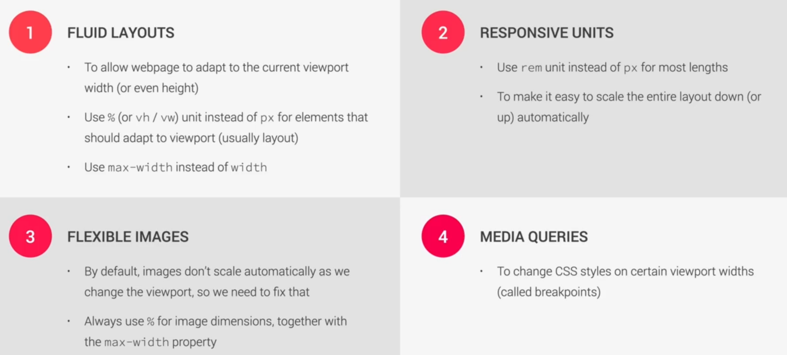
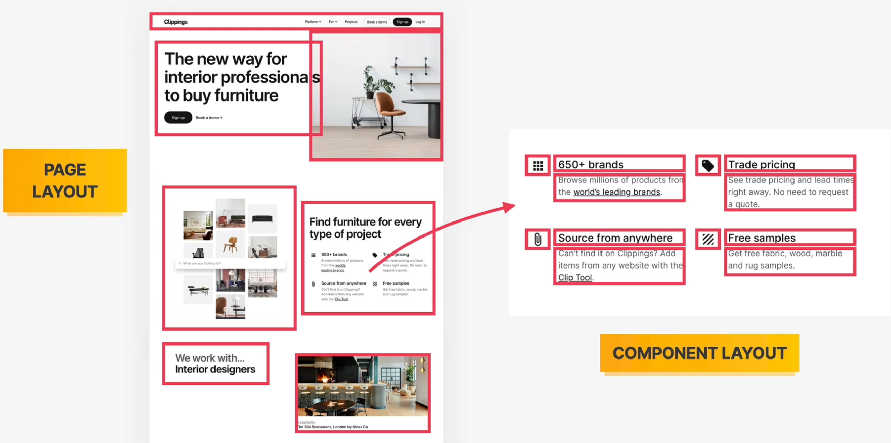
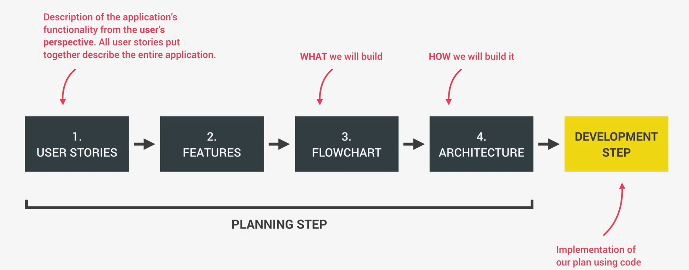
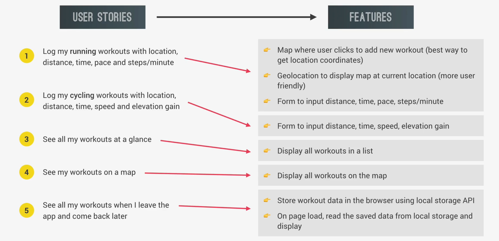
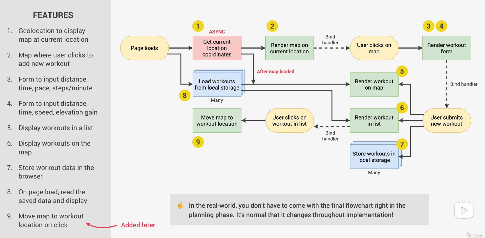

# Web design rules and guidelines

## What web design actually is? why it's so important?

1. Web designers create the overall look and feel of a website.
2. Web developers implement the design using HTML, CSS and Java Script code.
3. Everyone can learn basics by following **a framework/system**.

## 7 different web design personalities

1. **Serious/Elegant**: For luxury and elegance, based on thin **serif typefaces**,golden or **pastel colors**, and **big high-quality images**.
2. **Minimalist/Simple**: Focus on the essential text content，using **small or medium-sized sans-serif black text,** lines, and few images and icons.
3. **Plain/Neutral**: Design that gets out of the way by using neutral and small typefaces, and a very **structured layout**. **Common in big corporations**.
4. **Bold/Confident**: Makes an impact, by featuring **big and bold typography**, paired with confident use of **big and bright colored blocks**.
5. **Calm/Peaceful**: For products and services that care, transmitted by calming **pastel colors**, **soft serif headings,** and **matching images/illustrations**.
6. **Startup/Upbeat**: Widely used in startups, featuring **medium-sized sans serif typefaces**, light-grey text and backgrounds, and **rounded elements**.
7. **Playful/Fun**: Colorful and round designs, fueled by creative elements like **hand-drawn icons** or illustrations, **animations**, and **fun language**.

## Web design ingredients

1. Typography
2. Colors
3. Images/Illustrations
4. Icons
5. Shadows
6. Border-radius
7. Whitespace
8. Visual Hierarchy
9. User Experience 
10. Components/Layout 
11. 抓住问题的时候可能就是找到了答案。

### Typography

1. Typography is all about making texts beautiful and **easy to read**.
2. Serif and Sans-serif

- Serif typeface
  - Creates a traditional/classic look and feel
  - Conveys trust worthiness
  - Good for long text
- Sans-serif typeface
  - Modern look and feel
  - Clean and simple
  - Easier to choose for
  - beginner designer!

3. Use Good Typefaces

- Use only good and popular typefaces and play it safe
  - It's okay to use just **one typeface per page**! If you want more, **limit to 2 typefaces**.
  - Choose the right typeface according to your website personality.
  - When choosing font-sizes, **limit choices!** Use a "type scale" tool or other pre-defined range.
- Use a font size between **16px and 32px for "normal" text**
  - For long text (like a blog post), try a size of **20px or even bigger**.
  - For headlines, you can go really big (50px+)and bold (600+), depending on personality.
  - For any text, **don't use** a font weight under 400 (regular).
- Use less than 75 characters per line
  - For normal-sized text, use a line height between 1.5 and 2. For big text, go below 1.5(**The smaller or longer the text, the larger the lineheight needs to be!**).
  - Decrease letter spacing in headlines, if it looks unnatural (this will come from experience).
- Experiment with **all caps for short titles**. Make them **small and bold** and increase letter-spacing.
  - Usually, don't justify text. 
  - Don't center long text blocks. Small blocks are fine. 

### Color

1. Choose the right color:Make the main color match your website's personality: colorsconvey meaning!

   1. Red draws a lot of attention, and symbolizes **power, passion, and excitement**.
   2. Orange is less aggressive, and conveys **happiness, cheerfulness, and creativity**.
   3. Yellow means **joy, brightness, and intelligence**.
   4. Greens represents **harmony, nature, growth, and health** .
   5. Blue is associated with **peace, trustworthiness, and professionals**.
   6. Purple conveys **wealth, wisdom, and magic** .
   7. Pink represents **romance, care, and affection**.
   8. Brown is associated with **nature, durability and comfort**.
   9. Black symbolizes power, elegance and minimalism, but also **grief and sorrow** .

2. Establish a Color System 
   1. **Use a good color tone!** Don't choose a random tone or CSS named colors. 
   2. You need at least two types of colors in your color palette: **amain color and a grey color** .
   3. With more experience, you can add more colors: accentcolors (use a tool) .
   4. **For diversity**, create **lighter** and **darker** "versions" (tints and shades).
3. When and how to use colors
   1. Use your main color to **draw attention** to the **most important elements** on the page.
   2. Use colors to add interesting accents or **make entire components or sections stand out**.
   3. You can try to use your color strategically in images and illustrations.
4. Color and Typography
   1. On dark colored backgrounds, try to use a tint of the background **("lighter version") for text**.
   2. Text should usually **not be completely black**. Lighten it up it looks heavy and uninviting.
   3. Don't make text too light! Use a tool to check contrast between text and background colors.
   4. Contrast ratio needs to be at least 4.5:1 for normal text and 3:1 for large text (18px+).

### Image

1. Use good images
   1. Different types of images: **product photos, storytelling photos, illustrations、patterns(like background)**.
   2. Use images to support your website's **message and story**.So only use **relevant images!**
   3. Prefer **original images.** If not possible, use **original-looking** stock images (not generic ones!).
2. Use images well
   1. Try to show **real people** to trigger user's emotions.
   2. If necessary, **crop images** to fit your message.
   3. Experiment combining photos, illustrations and patterns. 
3. Handling Text on images
   1. Method 1: Darker or brighten image (completely or partially, using a gradient) .
   2. Method 2: Position text into neutral image area.
   3. Method 3: Put text in a box .
4. Some details
   1. To account for **high-res screens**, make image dimensions **2x as big as** their displayed size.
   2. **Compress images** for a lower file size and better performance.
   3. When using multiple images side-by-side, make sure they have **the exact same dimensions**.

### Icons

1. Use good icons
   1. Use a **good icon pack**, there are tons of free and paid icons packs.
   2. Use only one icon pack. Don't mix icons from different icon packs.
   3. Use **SVG icons or icon fonts**. Don't use bitmap image fornhats (.jpg and.png)!
   4. Adjust to website personality! **Roundness, weight** and filled/outlined depend on typography.
2. When to use icons
   1. Use icons to **provide visual assistance** to text.
   2. Use icons for **product feature blocks**.
   3. Use icons **associated with actions**, and label them (unless no space or icon is 100% clear).
   4. Use icons as **bullet points**.
3. How to use icons well
   1. **To keep icons neutral, use same color as text**. To draw more attention, use different color.
   2. **Don't confuse your users**: icons need to **make sense** and fit the text or action!
   3. Don't make icons larger than what they were designed for. If needed, enclose them in a shape.

### Shadows

1. What shadows can do
   1. After an era of 100% flat design, we're now back to using shadows in Ul design ("flat design 2.0")
   2. Shadow creates depth (3D): the more shadow, the **further away** from the interface the element is.
2. Use shadows well
   1. You **don't have to use** shadows! Only use them if it makes sense for the website personality.
   2. Use shadows in **small doses**: don't add shadows to every element!
   3. **Go light on shadows**, don't make them **too dark!**
3. Use shadows in the right situation
   1. Use **small shadows** for smaller elements that should stand out (to draw attention).
   2. Use medium-sized shadows for larger areas that should stand out a bit more.
   3. Use large shadows for elements that should really float above the interface.
   4. Experiment with changing shadows on mouse interaction(click and hover).
   5. Bonus: Experiment with glows (colored shadows).

### Border-radius

1. Use border-radius to increase the playfulness and fun of the design, to make it less serious.
2. Typefaces have a certain roundness: make sure that border-radius matches that roundness!
3. Use border-radius on buttons, images, around icons, standout sections and other elements.

### Whitespace

1. Why whitespace
   1. The right amount of whitespace makes designs look **clean, modern** and polished.
   2. Whitespace communicates how different pieces of information are **related to one another**. 
   3. Whitespace implies invisible relationships between the elements of a layout.
2. Where to use whitespace
   1. Use tons of whitespace **between sections**.
   2. Use a lot of whitespace **between groups of elements**.
   3. Use whitespace **between elements**.
   4. Inside **groups of elements**, try to use whitespace instead of lines.
3. How much whitespace
   1. **The more some elements (or groups of elements) belong together, the closer they should be!** 
   2. Start with **a lot of whitespace**, maybe even too much! Then **remove whitespace** from there Too much whitespace looks **detached,** too little looks too **crammed**.
   3. Match **other design choices**. If you have big text or big icons, you need more whitespace.
   4. Try a hard rule, such as using **multiples of 16px** for all spacing.

### Visual Hierarchy

1. What is Visual Hierarchy
   1. Visual hierarchy is about **establishing which elements** of a design **are the most important ones**.
   2. Visual hierarchy is about **drawing attention** to these most important elements.
   3. Visual hierarchy is about **defining a "path"** for users, to guide them through the page.
   4. We use a combination of **position, size, colors**, spacing, borders, and shadows to establish a meaningful visual hierarchy between elements/components.
2. Visual hierarchy fundamentals
   1. Position important elements closer to the top the page, where they get more attention.
   2. Use images mindfully, as they draw a lot of attention (larger images get more attention).
   3. Whitespace creates separation, so use whitespace strategically to emphasize elements.
3. Visual hierarchy for text elements
   1. For text elements, use **font size, font weight, color, and whitespace** to convey importance.
   2. What text elements to emphasize? **Titles, sub-titles, links, buttons, data points, icons**.
   3. You can also **de-emphasize less important text**, like labels or secondary/additional information.
4. Visual hierarchy between components
   1. Emphasize an important component using **background color, shadow, or border** (or multiple).
   2. Try emphasizing some component A over component B **by de-emphasizing component B**.
   3. What components to emphasize? **Testimonials, call-to-action sections, highlight sections preview cards, forms, pricing tables, important rows/columns in tables, etc.**

### User Experience

1. Design is not just what it looks like and feels like. Design is how it works. —— steve jobs
   1. Ul is graphical interface: UI Design is what makes an **interface beautiful**.
   2. UX is experience with interface: UX Design is what makes an **interface useful and functional**.
2. UX design guiding principle: goals
   1. A website or application exists for a reason: a user has a goal for visiting it, and a business has a goal for creating it.
3. UX rules for usability
   1. Don't design complicated layouts. Don't reinvent the wheel. **Use patterns that users know**.
   2. Make your call-to-action the **most prominent element**, and make the **text descriptive**.
   3. Use **blue text** and **underlined text** only for **links**!
   4. Animations should have a purpose and be fast: **between 200 and 500 ms**.
   5. In forms, align labels and fields in a single **vertical line**, to make the form **easier to scan**.
   6. Offer users **good feedback** for all actions: form errors, form success, etc. [web apps]
   7. Place action buttons where they will create an effect (law of locality). [web apps]
4. UX rulex for website content
   1. Use a descriptive, keyword-focused headline on your main page. Don't be vague or fancy!
   2. Only include relevant information, efficiently! Cut out fluff and make the content 100% clear.
   3. Use **simple words!** Avoid technical jargon and "smart-sounding" words
   4. Break up long text with **sub-headings, images, block quotes, bullet points**, etc.

## The website personalities- framework

### Steal like a artist.

### Elements and Components

1. Elements -> Components -> Layouts -> Webpages
   1. Use **common elements** and components to convey your website's information.
   2. Combine components into layouts using common layout patterns.
   3. Assemble different **layout areas** into a complete, final page.
2. Elements、Components 、Pattern
   1. Elements: Text、Buttons,Images,Input elements,Tags
   2. Components: Breadcrumbs（导航栏）,Pagination, Carousel（旋转展示）,Alert and status bars,Statistics（数据展示）,Gallery,Feature box（功能框）,Preview and profile cards（预览和资料卡）,Accordion(FAQ 组件),Tabs（选项卡，用于不同数据切换）,Customer testimonials（客户推荐）,Customer logos（客户 logo）,Featured-in logos（社会证明 logo）,Steps（步骤组件）,Forms（表格填写，登录注册）,Tables（表格数据展示）, ,Pricing tables（价格展示）,Modal windows（模型窗口）
   3. Section components: Navigation,Hero section,Footer,Call-to-action section,Feature row
   4. Layout patterns ：Row of boxes or cards ,Grid of boxes or cards ,Z-pattern ,F-Pattern ,Single-column ,Sidebar ,Multi-column/magazine ,Asymmetry/Experimental.

## The 7 Steps to a Great Website

### Define the project

1. Define **WHO the website is for.** Is it for yourself? For a client of your agency or your freelancing business?
2. Define **WHAT the website is for.** In other words, define businessand user goals of your website project ?(See lecture on UX).
3. Define a **target audience** Be really specific if possible and if it makes sense for your website (this can come from your client) （Example: "Women, 20 to 40 years old, living in Europe, earning over 2000€/month, with a passion for dogs" ）.

### Plan the project

1. Plan and gather **website content**: copy (text), images, videos etc.
2. Content is usually **provided by the client**, but you also can help them produce and find some content (simply finding free images easiest, but if they want copy, charge them extra).
3. For bigger sites, plan out the site map: **what pages the site needs**,and how they are related to one another (content hierarchy) .
4. **Based on the content**, plan what sections each page needs in order to convey the content's message. and in which order.**(先内容，后设计)**

### Sketch layout and component ideas

1. Think about what **components** you need, and **how you can use them** in layout patterns (Get inspiration in web design section).
2. Get ideas out of your head: sketch them **with pen and paper** or with some design software (eg. Figma)
3. This is an **iterative process: experiment with different components and layouts**, until you arrive at a first good solution.
4. You don't need to sketch everything, and don't make it perfect at some point, you're ready to jump into HTML and CSS.

### Design and build website

1. Use decisions, content and sketches from Steps 1, 2 and3 to design and build the website with HTML and CSS ("designing inthe browser").
2. You already have the layout and components that yopu selected in Step 3. In this step, you need to design the actual visual styles.
3. Create the design based on selected **website personality** the design guidelines I showed you, and inspiration See web design section).
4. Use the client's branding (it if exists already) for design decisions whenever possible: colors, **typography, icons,** etc.

### Test and optimize

1. Make sure website works well in **all major browsers** (Chrome Firefox, Safari, Edge).
2. Test the website on **actual mobile devices**, not just in DevTools.
3. Optimize all images, in terms of dimensions and file size (see lecture on images).
4. Fix simple **accessibility** problems (e.g. color contrast issuees).
5. Run the Lighthouse performance test in Chrome DevTools and try to fix reported issues.
6. Think about **Search Engine Optimization (SEO)**.

### Launch the masterpiece

1. Once all work is done, everything is perfect, and you got approval from your client (or yourself), **it's time to share your masterpiece with the world!**
2. Upload your website files to a hosting platform. There are countless platform, we will use one with a free plan (Netlify).
3. Choose and buy a great domain name, one that represents the brand well, is memorable and easy to write.

### Maintain and keep updating Website

1. Launching is not the end...
2. Keep the website content **updated over time.** If you're working with a client, you can create a monthly maintenance contract(recurring revenue)
3. Install **analytics software** (e.g. Google Analytics or Fathom) to get statistics about website users. This may inform future changes in the site structure and content.
4. A blog that is updated regularly is a good way to keep users coming back, and is also good for SEO.

## Responsive Design Principles

Design technique to make a webpage adjust its layout and visual style to **any possible screen size** (window or viewport size)

In practice, this means that responsive design makes website suable on all devices, such as **desktop computers, tablets, and mobile phones.**

It's a set of practices, **not a separate technology.** It's all just CSS!

### Fluid Layouts

1. To allow webpage to adapt to the **current viewport width** (or even height).
2. Use % (or vh / vw) unit instead of px for elements that **should adapt to viewport (usually layout)**.
3. Use max-width instead of width.

### Responsive units

1. Use rem unit instead of px for most lengths
2. To make it easy to **scale the entire layout down** (or up) automatically
3. **Helpful trick**: setting 1rem to 10px for easy calculations

### Flexible images

1. By default, images **don't scale automatically** as we change the viewport, so we need to fix that
2. Always use % for image dimensions, together with the max-width property

### Media Queries

1. Bring responsive sites to life!
2. To change CSS styles on **certain viewport widths** (called breakpoints)

### Desktop-first VS. Mobile-first Development

**Desktop-first**

1. Start writing CSS for the desktop: **large screen**.
2. Then, media queries **shrink design** to smaller screens.

**Pros**

1. 100% optimised for the mobile experience;
2. Reduces websites and apps to the absolute essentials;
3. Results in smaller, faster and more efficient products;
4. Prioritizes content over aesthetic design, which may be desirable.

**Cons**

1. The desktop version might feel overly empty and simplistic;
2. More difficult and counterintuitive to develop;
3. Less creative freedom, making it more difficult to create distinctive products;
4. Clients are used to see a desktop version of the site as a prototype;
5. Do your users even use the mobile internet? What's the purpose of your website?

**MOBILE-FIRST**

1. Start writing CSS for mobile devices: small screen
2. Then, media queries **expand design** to a large screen
3. Forces us to reduce websites and apps to the **absolute essentials.**

响应式设计关注的点:

1. 设备的宽度和断点
2. 设计中断的地方

## Project Planing ( js version)

### User story

**User story**: Description of the application's functionality from the user's perspective.

**Common format**: As a **[type of user]**,(WHO) I want **[an action]** (WHAT?)so that **[a benefit]** (WHY).

eg:

1. As a user, I want to **log my running workouts with location, distance, time, pace and steps/minute**, so I can keep a log of all my running.
2. As a user, I want to **log my cycling workouts with location, distance, time, speed and elevation gain**, so I can keep a log of all my cycling.
3. As a user, I want to **see all my workouts at a glance**, so I can easily track my progress over time.
4. As a user, I want to **also see my workouts on a map**, so I can easily check where I work out the most.
   As a user, I want to **see all my workouts when I leave the app and come back later,** so that I can keep using there app over time.

### Features

### Flowchart

## Asynchronous

